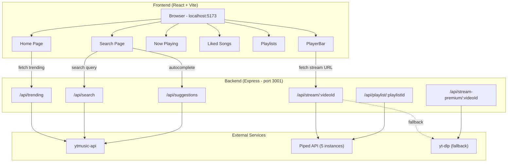
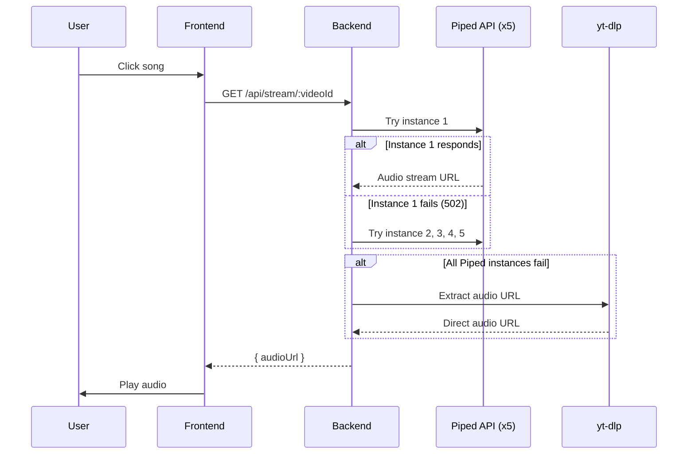

# Music Player

A YouTube Music-style web music player with a dark theme, streaming from YouTube Music via a Node.js backend. Built with React, Vite, and Express.

## Architecture



## Prerequisites

- [Node.js](https://nodejs.org/) v18 or higher
- [npm](https://www.npmjs.com/) (comes with Node.js)
- [yt-dlp](https://github.com/yt-dlp/yt-dlp) (important used as stream fallback)

## Setup

### 1. Clone the repository

```bash
git clone https://github.com/rahullxsharmaa/Music-Player.git
cd Music-Player
```

### 2. Install frontend dependencies

```bash
npm install
```

### 3. Install backend dependencies

```bash
cd server
npm install
cd ..
```

### 4. Start the backend server

Open a terminal and run:

```bash
cd server
node index.js
```

You should see:

```
Music Player API running on http://localhost:3001
[OK] ytmusic-api initialized
```

### 5. Start the frontend dev server

Open a second terminal and run:

```bash
npm run dev
```

### 6. Open the app

Go to `http://localhost:5173` in your browser.

## Project Structure

```
Music-Player/
├── index.html
├── package.json
├── vite.config.js
├── src/
│   ├── main.jsx              # Entry point
│   ├── App.jsx               # Layout + routing
│   ├── index.css              # Design system (dark theme)
│   ├── context/
│   │   └── UserContext.jsx    # Playback state, queue, library
│   ├── components/
│   │   ├── Nav.jsx            # Sidebar + mobile bottom nav
│   │   ├── PlayerBar.jsx      # Persistent bottom player
│   │   ├── Card.jsx           # Song card (carousel items)
│   │   ├── SongRow.jsx        # Song list row
│   │   └── Queue.jsx          # Queue sidebar
│   └── pages/
│       ├── Home.jsx           # Trending, quick picks, charts
│       ├── Search.jsx         # Search with suggestions
│       ├── NowPlaying.jsx     # Full-screen player
│       ├── Like.jsx           # Liked songs
│       └── Playlist.jsx       # Playlist management
└── server/
    ├── package.json
    └── index.js               # API server (Express)
```

## Stream Flow



## Optional: Premium Audio

For higher quality audio, you can provide YouTube cookies:

1. Install a browser extension that exports cookies in Netscape format (such as "Get cookies.txt LOCALLY")
2. Export your YouTube cookies
3. Save the file as `server/cookies.txt`
4. Restart the backend

The backend will automatically use cookies when available for `yt-dlp` requests.

## Troubleshooting

**Backend exits silently**: Make sure you are in the `server/` directory and run `node index.js`. Check that port 3001 is not in use by another process.

**Songs not playing**: The Piped API instances may be temporarily down. The backend will automatically try all 5 instances and fall back to yt-dlp. Make sure yt-dlp is installed if you want the fallback to work.

**No trending content**: The ytmusic-api needs a moment to initialize. Wait for the `[OK] ytmusic-api initialized` message before loading the frontend.

**CORS errors**: The backend allows all origins by default. If you changed the frontend port, it should still work.
