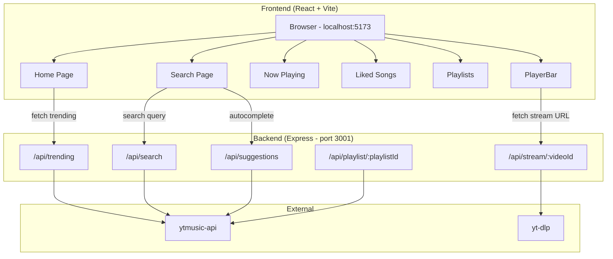
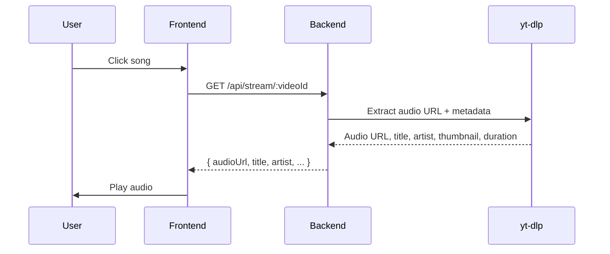

# Music Player

A YouTube Music-style web music player with streaming powered by yt-dlp and metadata from ytmusic-api.

## Architecture



## Stream Flow



## Setup

```bash
# Clone
git clone https://github.com/rahullxsharmaa/Music-Player.git
cd Music-Player

# Install dependencies
npm install
cd server && npm install && cd ..

# Start backend (terminal 1)
cd server
node index.js

# Start frontend (terminal 2)
npm run dev
```

Open `http://localhost:5173` in your browser.

## Troubleshooting

- **Backend exits silently** - Make sure you are in the `server/` directory. Check port 3001 is free.
- **Songs not playing** - Ensure yt-dlp is installed and accessible in your PATH.
- **No trending content** - Wait for the `[OK] ytmusic-api initialized` message before loading the frontend.

## Developed by *johnwick's himself*